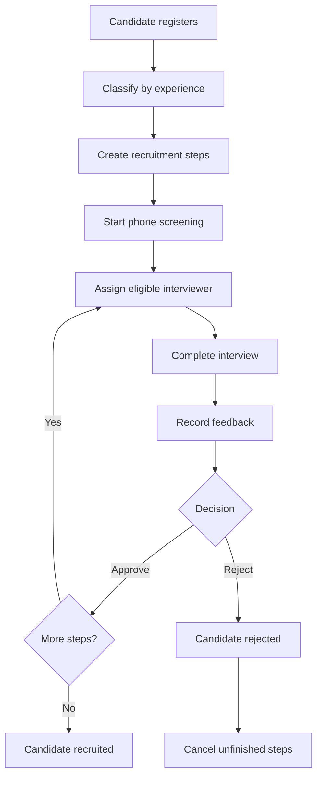

# Product guide

## Overview

Recruitment FastAPI manages candidate registration and a staged hiring process.
It classifies candidates by experience, creates the required interview steps,
restricts staff actions through permissions, and tracks each candidate to a
recruited or rejected outcome.

## Users and capabilities

- **Candidates** register without an account.
- **Application users** sign up and log in to receive an access token.
- **Authorized users** can view users, create roles and permissions, and assign
  them.
- **Interviewers** can be assigned only when their role is allowed for the
  interview type. Only the assigned interviewer can complete, review, approve,
  or reject that step.

The current product has no first-administrator setup. New users receive no roles,
so a newly deployed database requires authorization data to be created outside
the available product flow.

## Recruitment flow

A rejection ends the process and cancels remaining unfinished steps.

## Recruitment stages

A candidate path is a sequence of stages, and a stage can contain one or more
steps. Every step in the current stage must be approved before the next stage
starts. When a stage starts, all of its steps start together.

The candidate is recruited only after every step in every stage is approved.
The current entry, mid, and senior paths each place one step in every stage.

## Candidate paths

Candidates are classified from the submitted years of experience:

- **Entry, 0–3 years:** phone screening → DS/algorithm interview → background
  verification
- **Mid, 4–6 years:** phone screening → DS/algorithm interview → LLD interview
  → background verification
- **Senior, 7–100 years:** phone screening → DS/algorithm interview → LLD
  interview → HLD interview → background verification

## Interview assignment

Eligible interviewer roles are:

- Phone screening — recruiter
- DS/algorithm interview — engineer, senior engineer, or staff engineer
- LLD interview — senior engineer or staff engineer
- HLD interview — staff engineer
- Background verification — hiring manager

An assignment may include an interviewer, a future interview date, or both. When
both are present, the step becomes scheduled. Interview dates must be later than
the current UTC date.

## Statuses and decisions

A recruitment step can be initialized, in progress, scheduled, in review,
approved, rejected, or cancelled. Feedback must be recorded before approval or
rejection.

A candidate starts in progress and ends as either:

- **Recruited** after every required step is approved
- **Rejected** when any step is rejected

## Product boundaries

The implemented product does not currently provide:

- First-administrator or authorization-data bootstrap
- Candidate search, listing, editing, or deletion endpoints
- User self-service role management
- Deployment or operational monitoring features
